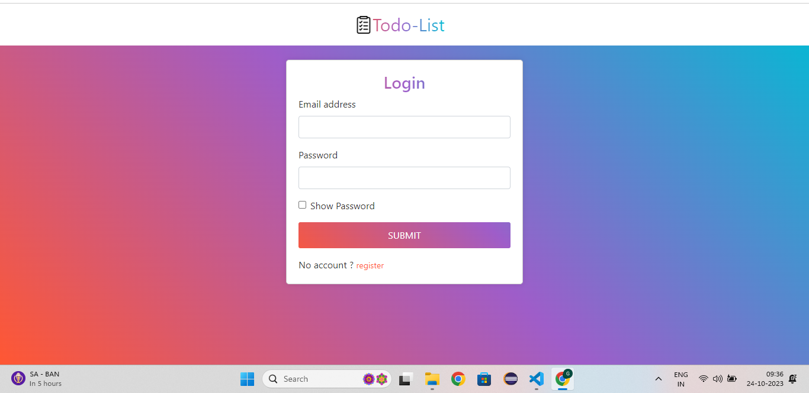
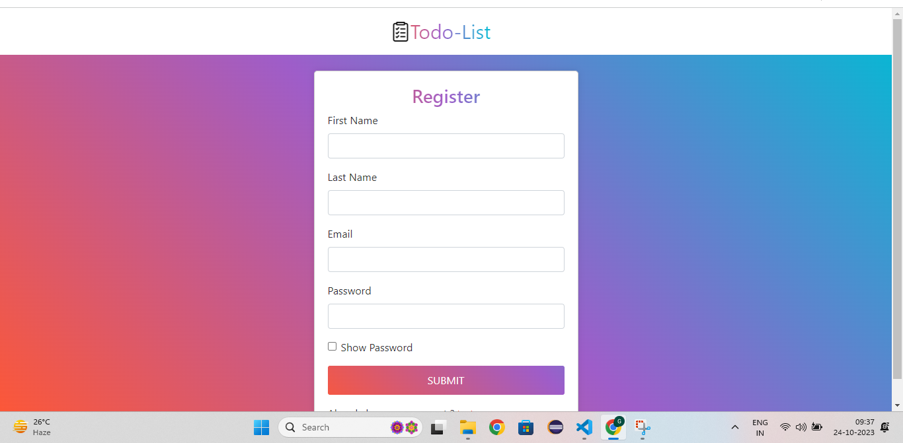
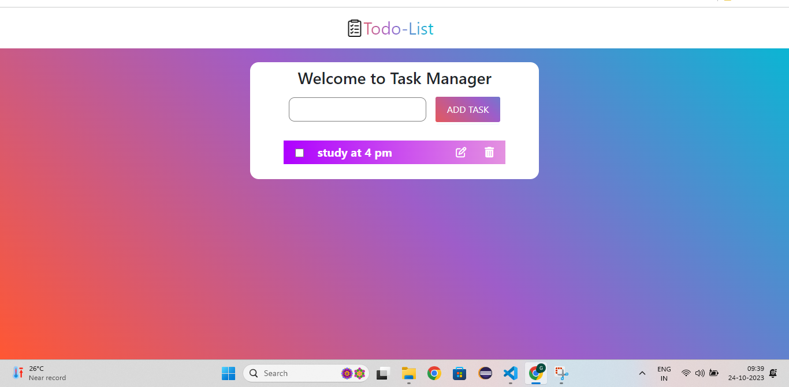
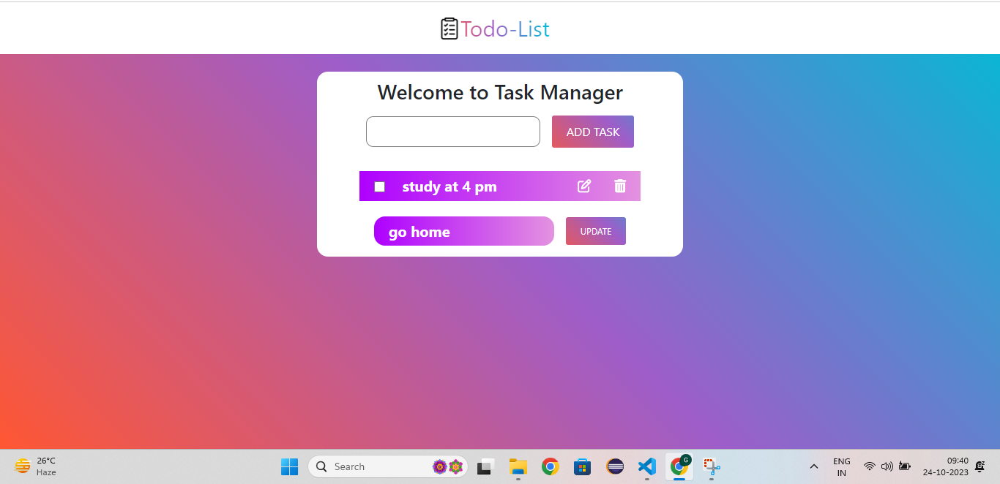
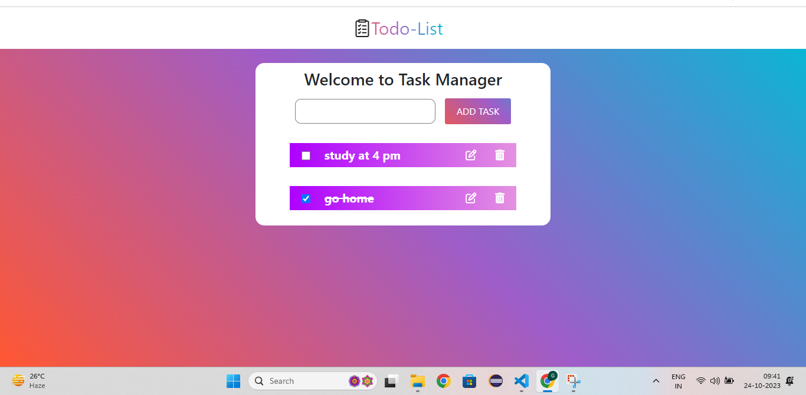

# Project Name

Todo-List

## Table of Contents

- [Introduction](#introduction)
- [Features](#features)
-[Some Images](#some-images)
- [Prerequisites](#prerequisites)
- [Getting Started](#getting-started)
- [Usage](#usage)

## Introduction

It is a simple Todo-List app , the user can register and login to the app.After login,the user can add,update,delete the tasks.

## Features

List key features and functionalities of your project.

- Authentication: The user data is secured,only the user can see the tasks he added to the task Manger.Others do not have access to it.
- CRUD feautre : The user can perform the crud operations like create,update,delete on the tasks easily.

## Some Images
 Login Page

Register Page

Home Page

Editing Task

Completed Task UI

  

## Prerequisites

Prerequisites or dependencies that need to be installed or set up before running the project. Provide installation instructions when necessary.

- [Node.js](https://nodejs.org/) 
- [npm](https://www.npmjs.com/) 
- Other dependencies...

## Technologies Used

- **Frontend**:
  - [React](https://reactjs.org/) - A JavaScript library for building user interfaces.
  - [Redux](https://redux.js.org/) - A predictable state container for managing application state.
  - [Axios](https://axios-http.com/) - For making HTTP requests.
  - [Bootstrap](https://getbootstrap.com/) - A CSS framework for responsive web design.

- **Backend**:
  - [Node.js](https://nodejs.org/) - A JavaScript runtime for building server-side applications.
  - [Express.js](https://expressjs.com/) - A web application framework for Node.js.
  - [Mongoose](https://mongoosejs.com/) - A ODM(Object Data Modeling) library for MongoDB and Node.js.
  - [MongoDB](https://www.mongodb.com/) - A NOSQL database to store the data of our web application.

- **Version Control**:
  - [Git](https://git-scm.com/) - A distributed version control system.
  - [GitHub](https://github.com/) - A web-based platform for hosting and collaborating on Git repositories.

- **Package Management**:
  - [npm](https://www.npmjs.com/) - A package manager for Node.js.

- **Code Editor**:
  - [Visual Studio Code (VSCode)](https://code.visualstudio.com/) - A lightweight, open-source code editor.

## Getting Started 
### Instruction to run the  project

Provide detailed instructions on how to get your project up and running. 

1. Clone the repository: git clone https://github.com/gopal265/todolist.git
2. Navigate to the project directory : cd todolist
3. Navigate to client folder : cd frontend
4. Install dependencies : npm install
5. Navigate to server folder : cd backend (in new terminal)
6. Install dependencies : npm install
7. Start the development server : npm start (in client)
8. Start the node server : nodemon index.js (in server in cmd only)
9. Open your browser and visit : http://localhost:3000
10. Note : Need to have Internet  for the backend to work,because the data is stored in Mongodb Atlas which is a cloud service

## Usage
For Demo use:
Email : admin@gmail.com
password : 123

After installing and running the project locally,when you go http://localhost:3000 . You will be landed in the login page where you need to enter the Email Id and password.If you have not register,you can click register below submit button and it will navigate to register page where you can reigster.Or you can use the above mentioned credentials for a demo use.After login,you can see a Task Manger page where you can add a task by typing the input and clicking add submit,you can delete task by pressing delete icon,can edit by pressing edit icon,you can check the box if the task is complete and you can see a linethrough the checked task indicating the task is complete.