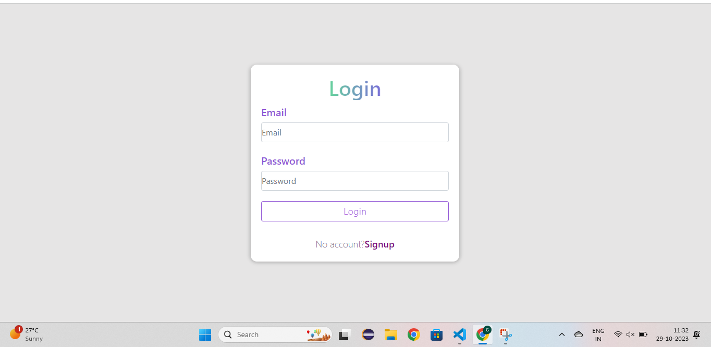

# Project Name

Personal Profile 

## Table of Contents

- [Introduction](#introduction)
-[Some Images](#some-images)
- [Prerequisites](#prerequisites)
- [Getting Started](#getting-started)
- [Usage](#usage)

## Introduction

It is a simple website that have clean login and register user interface , the user can register and login to the website.After login,the user can see his details and update them if needed as per his requirement.

## Live Project Link
Link :  https://profileui.onrender.com/
## Some Images

 Landing Page

 Login Page

 SignUp Page

Profile Page

Update Profile Page

  

## Prerequisites

Prerequisites or dependencies that need to be installed or set up before running the project.

- [Node.js](https://nodejs.org/) 
- [npm](https://www.npmjs.com/) 
- Other dependencies...

## Technologies Used

- **Frontend**:
  - [React](https://reactjs.org/) - A JavaScript library for building user interfaces.
  - [Axios](https://axios-http.com/) - For making HTTP requests.
  - [Bootstrap](https://getbootstrap.com/) - A CSS framework for responsive web design.

- **Backend**:
  - [Node.js](https://nodejs.org/) - A JavaScript runtime for building server-side applications.
  - [Express.js](https://expressjs.com/) - A web application framework for Node.js.
  - [Mongoose](https://mongoosejs.com/) - A ODM(Object Data Modeling) library for MongoDB and Node.js.
  - [MongoDB](https://www.mongodb.com/) - A NOSQL database to store the data of our web application.

- **Version Control**:
  - [Git](https://git-scm.com/) - A distributed version control system.
  - [GitHub](https://github.com/) - A web-based platform for hosting and collaborating on Git repositories.

- **Package Management**:
  - [npm](https://www.npmjs.com/) - A package manager for Node.js.

- **Code Editor**:
  - [Visual Studio Code (VSCode)](https://code.visualstudio.com/) - A lightweight, open-source code editor.

## Getting Started 
### Instruction to run the  project locally

1. Clone the repository: git clone https://github.com/gopal265/taskfrontend.git
2. Navigate to the project directory : cd taskfrontend
3. Install dependencies : npm install
4. Clone the repository: git clone https://github.com/gopal265/taskbackend.git
5. Navigate to server folder : cd taskbackend (in new terminal)
6. Install dependencies : npm install
7. Start the development server : npm start (in taskfrontend)
8. Start the node server : nodemon index.js (in taskbackend in cmd only)
9. Open your browser and visit : http://localhost:3000
10. Note1 : Need to have Internet  for the backend to work,because the data is stored in Mongodb Atlas which is a cloud service
11. Note2 : Need to change the base_url in src/api folder to  http://localhost:4500/api/user in the  taskfrontend
12. Note3 : Need to change orgin in corsOptions in index.js file to  http://localhost:3000 in the taskbackend

## Usage
For Demo use:
Email : admin@gmail.com
password : 1234567

After installing and running the project locally,when you go http://localhost:3000 . You will be landed in the landing.We can see two options sigup and login.If select login you will redirect to login  page where you need to enter the Email Id and password.If you have not register,you can click register below  button and it will navigate to register page where you can reigster.Or you can use the above mentioned credentials for a demo use.After login,you can see a Profile page where you can see your details and you update them by clicking the update button or you can click logout button to logout.